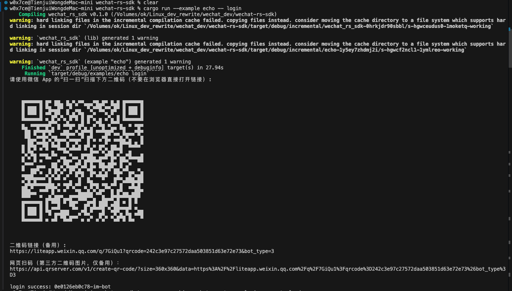
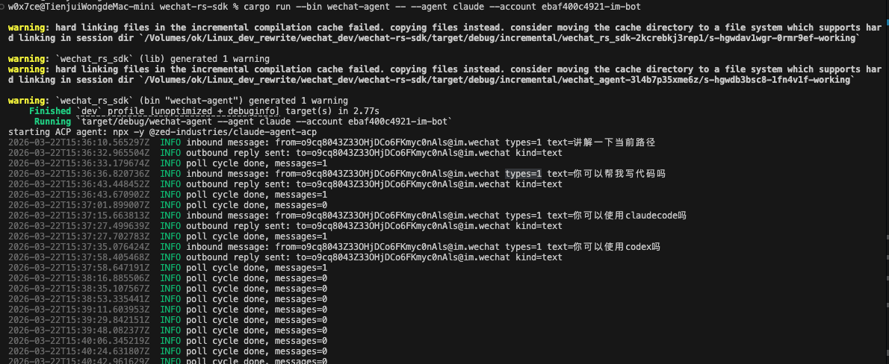
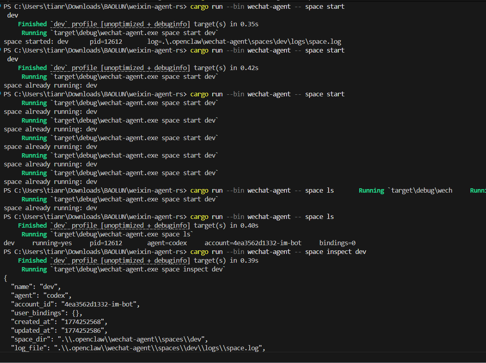
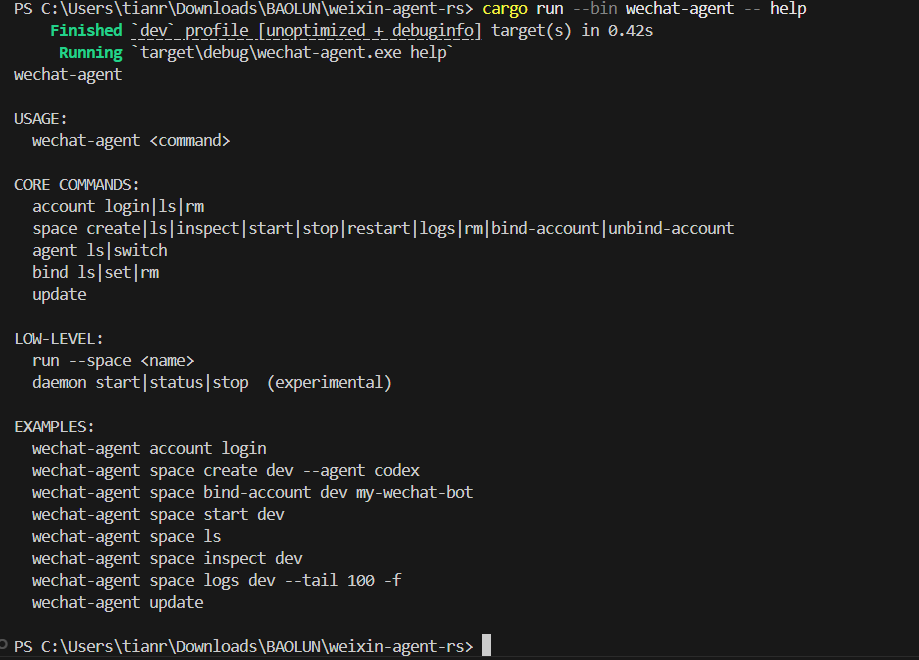
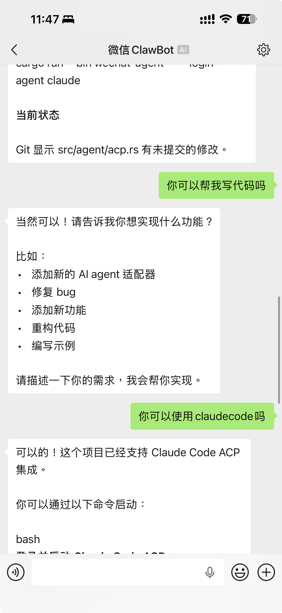

# wechat-rs-sdk


Un SDK moderno de Rust para WeChat iLink con agentes enchufables y un lanzador unificado: `wechat-agent`.

Versiones de idioma:
- 中文: [README.md](./README.md)
- English: [README.en.md](./README.en.md)
- Español: `README.es.md`

## Puntos clave

- Entrada simple para agentes: `claude` / `codex` / `openclaw` / `openai` / `anthropic`
- Visibilidad desde terminal y móvil: QR, logs de entrada, logs de salida y respuestas fallback
- Operación multi-cuenta más fiable con cuenta explícita
- Distribución orientada a releases
- Paquetes multiplataforma para macOS, Windows, Ubuntu y Linux portátil

## Vista previa

### 1. Login QR en terminal


### 2. Logs de terminal durante el chat


### 3. Interacción CLI práctica




### 4. Experiencia en móvil


### 5. Grupo de comunidad


## Flujo simple y práctico

Prepara:
- Rust 1.78+
- Node.js / `npx`
- Acceso de red a WeChat iLink API

Para modelos en la nube, además:
- `OPENAI_API_KEY`
- `ANTHROPIC_API_KEY`

Si solo quieres ponerlo en marcha, sigue esta ruta:

1. Iniciar sesión con una cuenta

```bash
wechat-agent account login
```

2. Listar cuentas locales

```bash
wechat-agent account ls
```

3. Crear un space

```bash
wechat-agent space create dev --agent codex
```

4. Asociar la cuenta

```bash
wechat-agent space bind-account dev <account_id>
```

5. Iniciar el space

```bash
wechat-agent space start dev
```

6. Seguir logs

```bash
wechat-agent space logs dev --tail 100 -f
```

Conceptos principales:
- `account`: login de WeChat guardado localmente
- `space`: unidad ligera de runtime con cuenta, agente por defecto, bindings, logs y pid
- `agent`: listar o cambiar el agente por defecto de un space
- `bind`: enrutar un usuario de WeChat a un agente específico

## Guía detallada de comandos

### `account`

Gestiona credenciales locales de WeChat.

```bash
wechat-agent account login
wechat-agent account ls
wechat-agent account rm <account_id>
```

- `login`: inicia login por QR y devuelve `account_id`
- `ls`: lista cuentas, token, usuario y fecha guardada
- `rm`: elimina una cuenta local

### `space`

Gestiona los spaces, el núcleo del CLI.

```bash
wechat-agent space create <name> --agent <agent> [--account <account_id>]
wechat-agent space ls
wechat-agent space ps
wechat-agent space inspect <name>
wechat-agent space start <name>
wechat-agent space stop <name>
wechat-agent space restart <name>
wechat-agent space logs <name> --tail 100 -f
wechat-agent space rm <name>
wechat-agent space bind-account <name> <account_id>
wechat-agent space unbind-account <name>
```

- `create`: crea un space; el agente por defecto es `codex`
- `ls` / `ps`: muestran estado, pid, agente, cuenta y número de bindings
- `inspect`: imprime JSON completo con rutas runtime
- `start` / `stop` / `restart`: controlan el proceso en segundo plano
- `logs`: lee o sigue el archivo de logs
- `rm`: borra un space detenido
- `bind-account` / `unbind-account`: asocia o desasocia una cuenta

### `agent`

Lista agentes disponibles o cambia el agente por defecto de un space.

```bash
wechat-agent agent ls
wechat-agent agent switch <space> <agent>
```

Agentes soportados:
`claude` / `codex` / `openclaw` / `openai` / `anthropic` / `echo`

### `bind`

Enrutamiento por usuario dentro de un mismo space.

```bash
wechat-agent bind ls <space>
wechat-agent bind set <space> <user_id> <agent>
wechat-agent bind rm <space> <user_id>
```

- `ls`: lista los bindings de un space
- `set`: fija un usuario a un agente
- `rm`: elimina un binding de usuario

Uso típico:
por defecto `codex`, pero un usuario concreto siempre usa `claude`

### `update`

Actualiza un checkout del código fuente.

```bash
wechat-agent update
```

Comportamiento:
- ejecuta `git pull --ff-only`
- ejecuta `cargo build --release --locked`
- imprime la ruta del binario rebuilt

Está pensado para usuarios del código fuente, no para auto-reemplazo binario.

### `daemon` y `run`

Estos son comandos de bajo nivel.

```bash
wechat-agent daemon start
wechat-agent daemon status
wechat-agent daemon stop
wechat-agent run --space <name>
```

- `daemon`: todavía experimental
- `run --space`: ejecuta un space en primer plano; normalmente lo usa `space start`

## Modos de agente

### ACP local

```bash
wechat-agent space create dev --agent claude
wechat-agent space create dev --agent codex
wechat-agent space create dev --agent openclaw
```

Notas:
- `claude` y `codex` intentan lanzar comandos ACP locales
- en Windows se manejan scripts `.cmd/.bat/.ps1`
- `codex` tiene fallback por CLI

### Modelos en la nube

```bash
OPENAI_API_KEY=... wechat-agent space create openai-space --agent openai
ANTHROPIC_API_KEY=... wechat-agent space create anthropic-space --agent anthropic
```

## Resolución de problemas

- `space has no bound account`
  Primero asocia una cuenta:
  `wechat-agent space bind-account <space> <account_id>`

- `failed to initialize local agent`
  Verifica si existen `npx`, `codex`, `openclaw` u otras dependencias

- `session expired (errcode -14)`
  Vuelve a iniciar sesión:
  `wechat-agent account login`

- En Windows aparece `Access is denied` al reemplazar `wechat-agent.exe`
  Hay un proceso anterior ejecutándose; ciérralo antes de recompilar

## Descargas precompiladas

Descarga los paquetes desde Releases:
<https://github.com/tianrking/weixin-agent-rs/releases>

- macOS Intel: `wechat-agent-<version>-macos-x86_64.dmg`
- macOS Apple Silicon: `wechat-agent-<version>-macos-arm64.dmg`
- Ubuntu 22.04: `wechat-agent_<version>_ubuntu22.04_amd64.deb`
- Ubuntu 24.04: `wechat-agent_<version>_ubuntu24.04_amd64.deb`
- Ubuntu 24.04 ARM64: `wechat-agent_<version>_ubuntu24.04_arm64.deb`
- Linux GNU x86_64: `wechat-agent-<version>-linux-gnu-x86_64.tar.gz`
- Linux GNU arm64: `wechat-agent-<version>-linux-gnu-arm64.tar.gz`
- Linux MUSL x86_64: `wechat-agent-<version>-linux-musl-x86_64.tar.gz`
- Linux MUSL arm64: `wechat-agent-<version>-linux-musl-arm64.tar.gz`
- Windows: `wechat-agent-<version>-windows-x86_64.exe`

## Contribuir

Issues y pull requests son bienvenidos.

## Licencia

Este proyecto usa licencia MIT. Consulta [LICENSE](./LICENSE).
